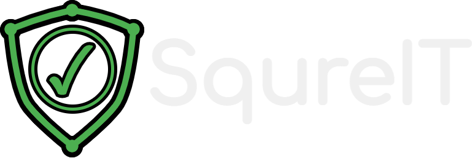

<!---
This README.md file is based on https://github.com/othneildrew/Best-README-Template

Copyright (c) 2021 Othneil Drew

Permission is hereby granted, free of charge, to any person obtaining a copy
of this software and associated documentation files (the "Software"), to deal
in the Software without restriction, including without limitation the rights
to use, copy, modify, merge, publish, distribute, sublicense, and/or sell
copies of the Software, and to permit persons to whom the Software is
furnished to do so, subject to the following conditions:

The above copyright notice and this permission notice shall be included in all
copies or substantial portions of the Software.
-->

<a name="readme-top"></a>


<br />
<div align="center">
  <a href="https://github.com/SoftCysec/Gamified-Cybersecurity-Application">
    
  </a>

  <h3 align="center">SqureIT</h3>

  <p align="center">
    A cyber safety and security awareness platform focused on children and their caretakers.
    <br />
    ·
    <a href="https://github.com/SoftCysec/Gamified-Cybersecurity-Application/issues">Report Bug</a>
    ·
    <a href="https://github.com/SoftCysec/Gamified-Cybersecurity-Application/issues">Request Feature</a>
  </p>
</div>


<details>
  <summary>Table of Contents</summary>
  <ol>
    <li>
      <a href="#getting-started">Getting Started</a>
    </li>
    <li><a href="#license">License</a></li>
    <li><a href="#contact">Contact</a></li>
  </ol>
</details>


# Getting Started

## Gamified Cybersecurity

This repository contains the source code for the Gamified Cybersecurity project, a web application focused on cyber safety and security awareness.

## Getting Started

These instructions will guide you through setting up and running the project on your local machine for development and testing purposes.

### Prerequisites

Before you begin, make sure you have the following installed:
- Git
- Docker

### Cloning the Repository

First, clone the repository to your local machine:

```bash
git clone https://github.com/SoftCysec/Gamified-Cybersecurity-Application.git
cd Gamified-Cyber-Edu


# Running the Application with Docker

The application is containerized with Docker, making it easy to set up and run. To start the application:

1. Pull the Docker image from Docker Hub:
```
docker pull softcysec/gamified-cybersec:v4-latest
```
2. Run the Docker container:
```
docker run -p 80:80 softcysec/gamified-cybersec:v4-latest
```
This command will start the container and map port 80 in the container to port 8080 on your host machine.
3. Access the application:

Open your web browser and navigate to `http://localhost:8080`. You should see the Gamified Cybersecurity application running.


# Stopping the Application

To stop the running Docker container:
1. Find the container ID:
```
docker ps
```
2. Stop the container:
```
docker stop <container-id>
```

## License

Distributed under the GPL-3.0 license. See `LICENSE` for more information.

<p align="right">(<a href="#readme-top">⬆️</a>)</p>


## Contact

Project Link: [https://github.com/SoftCysec/Gamified-Cybersecurity-Application](https://github.com/SoftCysec/Gamified-Cybersecurity-Application)

Website: [https://squre-it.onrender.com](squre-it.onrender.com)

<p align="right">(<a href="#readme-top">⬆️</a>)</p>
